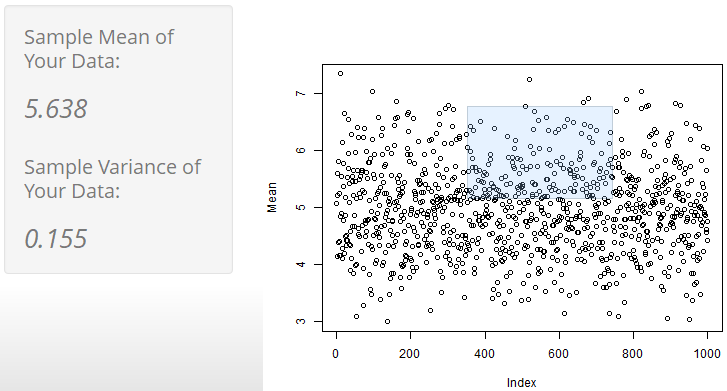
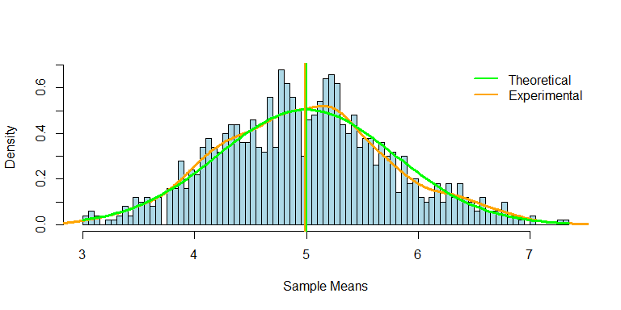

# Central Limit Theorum Demo
Jacob Schwartz  
October 4, 2017  

## Overview

The Shiny application I created is an interactive demonstration of Central Limit Theorum. This builds off of the final project from the Statistical Inference course, in the Data Science Specialization on Coursera, offered by Johns Hopkins University.

The exponential distribution can be simulated in R with `rexp(n, lambda)` where lambda is the rate parameter. The mean of exponential distribution is `1/lambda` and the standard deviation is also `1/lambda`. In our demonstration we treat this as our null hypothesis essentially. We set `lambda = 0.2` for all of the simulations, and a default number of samples of 40. The default number of simulations is set at 100.

## User Controls

The user of the application is given an enormous amount of control over the demonstration, including how big a sample to take for each simulation, how many simulations to average together, what to display on the final simulation graph, and even where to start the "randomized" trials (the input number to `set.seed()`).

Additionally, simulation itself won't run automatically. An activation button is also provided, so a user can fully input their chosen parameters before recalculating.

*Note: The controls below are not interactive. They are just for demonstration.*

## Data Selection

On the 2nd tab of the application there is an added functionality, where the user can select their own dataset from the calculated means of the simulation. The user can also choose to graph the distribution of their own selected dataset.  Though this strays from the CLT demonstration somewhat, it's there to give the user further insight into the inner workings of the demo. That said, the more data the user selects, the more their customized distribution will adhere to the CLT.

## Final Product

The final result is a density graph of `rexp()` simulations, with density curves and value comparisons, based on the user's selections.

A sample of the final density curve is below. For the full application, with all interactive controls, please click [here](https://schwarja209.shinyapps.io/central_limit_theorum_demo/).

<!-- -->
