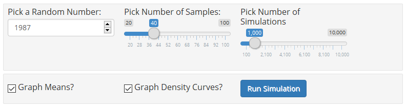
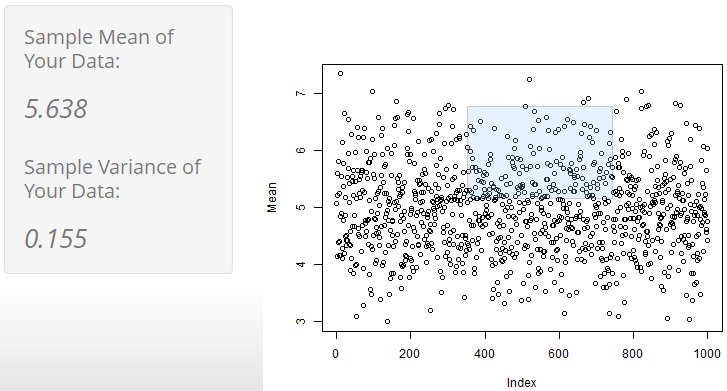

```{r setup, include=FALSE}
knitr::opts_chunk$set(echo = FALSE)
```

```{r libraries, results="hide", warning=FALSE, message=FALSE}
library(dplyr)
```

##Overview

The Shiny application I created is an interactive demonstration of Central Limit Theorum. This builds off of the final project from the Statistical Inference course, in the Data Science Specialization on Coursera, offered by Johns Hopkins University.

The exponential distribution can be simulated in R with `rexp(n, lambda)` where lambda is the rate parameter. The mean of exponential distribution is `1/lambda` and the standard deviation is also `1/lambda`. In our demonstration we treat this as our null hypothesis essentially. We set `lambda = 0.2` for all of the simulations, and a default number of samples of 40. The default number of simulations is set at 100.

```{r calculations, comment="", warning=FALSE, message=FALSE, cache=TRUE}
lambda<-0.2 #assign default lambda
n<-40 #assign default sample size
nsim1<-1000 #assign default simulation count
set.seed(1987) #set default seed for reproducibility
mean_theory1<-1/lambda #find population/theoretical mean
var_theory1<-(1/lambda)^2/n #find population/theoretical variance

sim1<-matrix(data=rexp(n*nsim1,rate=lambda),nrow=nsim1,ncol=n) #create simulation matrix for rexp()
sim1_mean<-data.frame(Mean=rowMeans(sim1)) #take mean of each simulation, and store in data frame
sim1_mean<-mutate(sim1_mean,Index=row.names(sim1_mean))%>%select(Index,Mean) #tidy data frame
```

##User Controls

The user of the application is given an enormous amount of control over the demonstration, including how big a sample to take for each simulation, how many simulations to average together, what to display on the final simulation graph, and even where to start the "randomized" trials (the input number to `set.seed()`).

Additionally, simulation itself won't run automatically. An activation button is also provided, so a user can fully input their chosen parameters before recalculating.

*Note: The controls below are not interactive. They are just for demonstration.*




##Data Selection

On the 2nd tab of the application there is an added functionality, where the user can select their own dataset from the calculated means of the simulation. The user can also choose to graph the distribution of their own selected dataset.  Though this strays from the CLT demonstration somewhat, it's there to give the user further insight into the inner workings of the demo. That said, the more data the user selects, the more their customized distribution will adhere to the CLT.



```{r userGraph, fig.width=8, fig.height=4, cache=TRUE}
#sidebarPanel( #display shiny outputs based on user selections
#    p("Sample Mean of Your Data: "),em(textOutput("userMean")),br(),
#    p("Sample Variance of Your Data: "),em(textOutput("userVariance"))
#)

#mainPanel( #display an interactive scatterplot
#    em(p("Select data points below for a demonstration.")),
#    plotOutput("userPlot", brush = brushOpts(id = "brush1"))
#)

#output$userPlot<-renderPlot({ #generate a scatterplot output
#    plot(sim1_mean)
#})

#output$userMean<-renderText({ #generate sample mean based on user dataset selection
#    userData<-brushedPoints(sim1_mean,input$brush1,xvar="Index",yvar="Mean")
#    if(nrow(userData)<2){
#        mean_sample2<-"Not enough points selected"
#    }else{
#        mean_sample2<-paste0(round(mean(userData$Mean),3))
#    }
#    
#    return(mean_sample2)
#})

#output$userVariance<-renderText({ #generate sample variance based on user dataset selection
#    userData<-brushedPoints(sim1_mean,input$brush1,xvar="Index",yvar="Mean")
#    if(nrow(userData)<2){
#        var_sample2<-"Not enough points selected"
#    }else{
#        var_sample2<-paste0(round(var(userData$Mean),3))
#    }
#    
#    return(var_sample2)
#})
```

##Final Product

The final result is a density graph of `rexp()` simulations, with density curves and value comparisons, based on the user's selections.

A sample of the final density curve is below. For the full application, with all interactive controls, please click [here](https://schwarja209.shinyapps.io/central_limit_theorum_demo/).

```{r finalGraph, fig.width=8, fig.height=4, cache=TRUE}
#sidebarPanel( #display sample user controls for graph
#    numericInput("seed1","Randomizer",value=1987,min=-2147483647,max=2147483647,step=1),
#    sliderInput("simulations1","Number of Simulations",
#                min=100,max=10000,value=1000,step=100)
#)

#mainPanel( #display interactive histogram distribution plot
#    plotOutput("histPlot")
#)

#output$histPlot<-renderPlot({ #generate interactive histogram distribution plot
#    set.seed(input$seed1) #reassign seed from user input
#    nsim1<-input$simulations1 #reassign simulation count from user input
#    
#    sim1<-matrix(data=rexp(n*nsim1,rate=lambda),nrow=nsim1,ncol=n) #regenerate simulations
#    sim1_mean<-data.frame(Mean=rowMeans(sim1))
#    sim1_mean<-mutate(sim1_mean,Index=row.names(sim1_mean))%>%select(Index,Mean)
#    
    mean_sample1<-mean(sim1_mean$Mean) #find sample mean
    var_sample1<-var(sim1_mean$Mean) #find sample variance
#    
#    #simulation with means
    hist(sim1_mean$Mean,breaks=100,freq=FALSE,main="",col="lightblue",xlab="Sample Means")
    
    x1<-seq(min(sim1_mean$Mean),max(sim1_mean$Mean),length=100) #create spread for density curve
    y1<-dnorm(x1,mean=mean_theory1,sd=sqrt(var_theory1)) #create distribution for density    
    
    lines(density(sim1_mean$Mean),col="orange",lwd=3) #print sample density curve
    lines(x1,y1,col="green",lwd=3)
    
    abline(v=mean_sample1,col="orange",lwd=2) #print mean lines on graph
    abline(v=mean_theory1,col="green",lwd=2)
    
    legend("topright",legend=c("Theoretical","Experimental"),
           col=c("green","orange"),lwd=2,box.lty=0)
#})
```